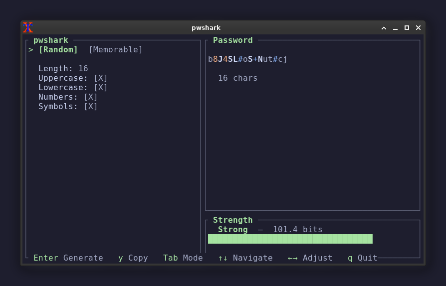

# pwshark 🦈

NIST-compliant password generator. btop-style TUI. Offline. Lightning fast.



## Features

- **Two modes** — Random (charset-based) and Memorable (word-based passphrases)
- **NIST SP 800-90A** — CSPRNG for all random values
- **NIST SP 800-63B** — 8–64 char range, no forced composition rules
- **Word truncation** — keeps first vowel + consonants ≤5 chars (e.g. "seemingly" → "semng")
- **Orchard Street Long List** — 17,576-word curated wordlist embedded in binary
- **Mode-aware entropy** — charset entropy for random mode, real diceware entropy
  (word count × pool size, adjusted for truncation collisions) for memorable mode
- **Color-coded output** — uppercase bright, lowercase dim, numbers orange, symbols blue
- **Clipboard auto-clear** — copies and clears after 15 seconds
- **Pipe mode** — `--stdout` for scripting
- **Responsive layout** — two-column on wide terminals, single-column on narrow
- **Memory-safe** — passwords zeroed on drop via Zeroize
- **Single binary** — no runtime dependencies, word list compiled in

## Install

### One-line (Linux/macOS)

```bash
curl -fsSL https://raw.githubusercontent.com/greenseeing/pwshark/main/install.sh | bash
```

This downloads a prebuilt static binary from the latest [GitHub release](https://github.com/greenseeing/pwshark/releases) (verifying its SHA256) and installs it to `~/.local/bin/pwshark` — no Rust toolchain required. On an unsupported architecture or if the download fails, it falls back to building from source.

Pin a specific version with `PWSHARK_VERSION`:

```bash
PWSHARK_VERSION=0.1.1 curl -fsSL https://raw.githubusercontent.com/greenseeing/pwshark/main/install.sh | bash
```

### Updating

```bash
pwshark update
```

Re-runs the installer, which downloads the latest release. It's a fast no-op when you're already up to date.

### From source

```bash
# Prerequisites: Rust toolchain (https://rustup.rs)
git clone https://github.com/greenseeing/pwshark.git
cd pwshark
cargo build --release
sudo cp target/release/pwshark /usr/local/bin/
```

### Dependencies

The prebuilt binary is fully static and needs **no runtime dependencies** — clipboard support uses a pure-Rust X11 backend that talks to the X server over a socket. The dependencies below apply only to a **source build** (the installer fallback or `cargo build`):

| What | Why | Installed by |
|------|-----|-------------|
| Rust | Compile from source | rustup |
| libxcb1-dev, libx11-dev, libxkbcommon-dev | Build arboard (clipboard) on Linux | `apt install ...` |

> **Note:** When building from source on Debian/Ubuntu, install the build deps first:
> ```bash
> sudo apt install libxcb1-dev libx11-dev libxkbcommon-dev
> ```

## Uninstall

pwshark is a single binary and writes no config or data files, so removing it is
just deleting the binary:

```bash
# Default location for the one-line installer
rm -f ~/.local/bin/pwshark

# Installed somewhere else? Find it first:
which pwshark
# e.g. a manual `cargo build` install:
sudo rm -f /usr/local/bin/pwshark
```

If the installer ever fell back to building from source, it also cloned the repo
to `~/.local/share/pwshark` — remove that too:

```bash
rm -rf ~/.local/share/pwshark
```

## Usage

### TUI mode

```bash
pwshark
```

| Key | Action |
|-----|--------|
| `Tab` | Switch Random / Memorable mode |
| `↑↓` | Move between options |
| `←→` | Adjust value or toggle option |
| `Enter` | Generate new password |
| `y` | Copy to clipboard (auto-clears in 15s) |
| `q` | Quit |

### Pipe mode

```bash
# Random password (16 chars, default)
pwshark --stdout

# Memorable passphrase (4 words, truncated, capitalized, with numbers)
pwshark --stdout --mode memorable

# Custom: 8 words, dot separator, no truncate
pwshark --stdout --mode memorable --words 8 --separator . --no-truncate

# Random 32-char, no symbols
pwshark --stdout --length 32 --no-symbols

# Random, excluding visually ambiguous characters (0 O 1 l I)
pwshark --stdout --exclude-ambiguous

# Generate 10 at once
pwshark --stdout --count 10

# JSON output for scripting (array of {password, entropy, strength})
pwshark --stdout --count 5 --json

# Copy directly to clipboard (Linux)
pwshark --stdout | xclip -selection clipboard
```

### All flags

```
--stdout                 Output raw password to stdout (no TUI)
--count <N>              Number of passwords to generate, stdout mode [default: 1]
--json                   Emit JSON (stdout mode): array of {password, entropy, strength}
--notice                 Print third-party attribution for the embedded wordlist and exit
--mode <MODE>            random | memorable [default: random]
--length <N>             Password length, random mode [default: 16]
--words <N>              Word count, memorable mode [default: 4]
--separator <CHAR>       Word separator [default: -]
--uppercase              Include uppercase (default: on)
--lowercase              Include lowercase (default: on)
--numbers                Include numbers (default: on)
--symbols                Include symbols (default: on)
--exclude-ambiguous      Drop visually ambiguous chars 0 O 1 l I, random mode (default: off)
--capitalize             Random capitalization, memorable mode (default: on)
--add-numbers            Add random numbers, memorable mode (default: on)
--truncate               Truncate words ≤5 chars (default: on)
--no-uppercase           Disable uppercase
--no-lowercase           Disable lowercase
--no-numbers             Disable numbers
--no-symbols             Disable symbols
--no-capitalize          Disable random capitalization
--no-add-numbers         Disable random numbers
--no-truncate            Disable word truncation
```

## Defaults

**Random mode:** length 16, uppercase on, lowercase on, numbers on, symbols on.

**Memorable mode:** 4 words, `-` separator, random capitalize on, add numbers on, truncate on.

Auto-generates on launch.

## Building

```bash
cargo build --release
```

Produces `target/release/pwshark` (~2MB static binary).

## License

MIT — see [LICENSE](LICENSE).

The embedded wordlist (`wordlist.txt`) is the [Orchard Street Long List](https://github.com/sts10/orchard-street-wordlists)
by Sam Schlinkert, bundled unmodified under [CC BY-SA 4.0](https://creativecommons.org/licenses/by-sa/4.0/).
See [NOTICE](NOTICE) for attribution.
